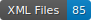

# DLA_FR-LA_16-17

    

This repository contains data on the segmentation of early modern printed French and Latin texts (late 16th–17th centuries).

## Content

| Author           | Title                | Date     | Location | Publisher | Segmentation |
|------------------|----------------------|----------|----------|-----------|--------------|
| s.n. | [_Le faux visage descouvert du fin renard de la France_](https://viewer.onb.ac.at/10790D2D) | 1589 | Vienna, ONB | Jacques de Varangles | N. Champeaux
| s.n. | sample of [_Dialogue du Royaume_](https://gallica.bnf.fr/ark:/12148/bpt6k74929k) | 1589 | Paris, BNF | Didier Millot | N. Champeaux |
| Jacques Baron | sample of [_Origine, genealogie et demonstration_](https://books.google.fr/books?id=d_vD7CdvG44C) | 1589 | Londres, British Library | Jean Perinet | N. Champeaux |
| Nicolas Le Digne | sample of [_Le Tombeau de hault et puissant seigneur Jean Lois de la Roche Foucault_](https://gallica.bnf.fr/ark:/12148/bpt6k62800568) | 1590 | Paris, BNF| Leger Delas | N. Champeaux |
| Pierre Turrel |sample of [_Contra Othomani Francogalliam libellus_](https://www.digitale-sammlungen.de/view/bsb10178119) | 1576 | Munich, Bayerische Staatsbibliothek | Michel de Roigny | N. Champeaux |
| Noël Taillepied |sample of [_Recueil des Antiquitez et singularitez de la ville de Pontoise_](https://gallica.bnf.fr/ark:/12148/bpt6k108625t) | 1587 | Paris, BNF | George l'Oiselet | N. Champeaux |
| Charles Pinselet |sample of [_Le Martyre de Frere Jacques Clement_](https://bibnum.institutdefrance.fr/viewer/18652) | 1589 | Paris, Bibliothèque Mazarine | Robert le Fizelier | N. Champeaux |
| Jean de Caumoont |sample of [_De l'Union des Catholiques_](https://bibnum.institutdefrance.fr/viewer/18652) | 1587 | Paris, BNF | Nicolas Nivelle | N. Champeaux |

## How to cite

If you use this dataset, please cite it as below : Champeaux Nicolas, [_DLA_FR-LA_16-17_], mai 2025.
 
## Licences

  

